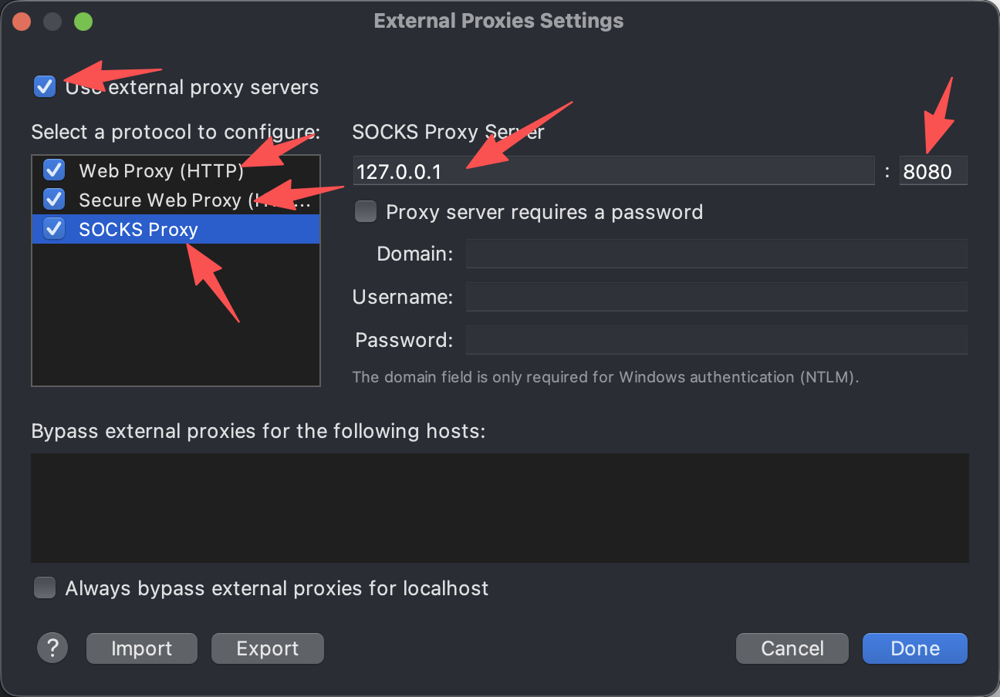
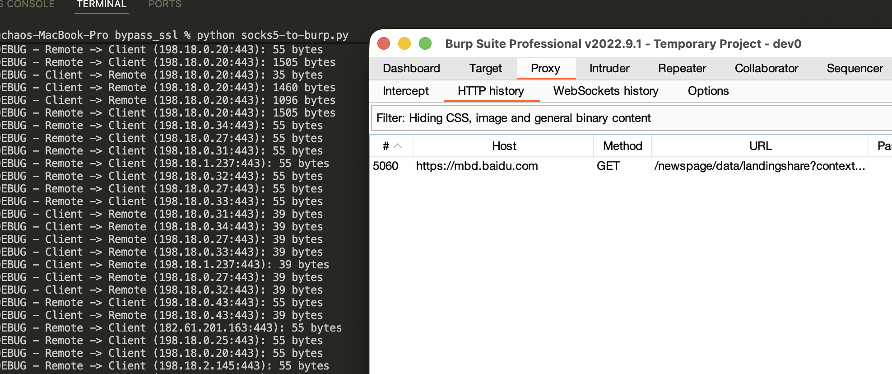

# Android手机抓包记录

## 手机信息

Google Pixel 4/Android 13

## 刷机
下载Pixel4对应的固件，安装手机usb驱动
```bash
https://developers.google.cn/android/images?hl=zh-cn#flame
https://developer.android.google.cn/studio/run/win-usb?hl=zh-cn
```
固件页面


usb驱动下载与安装


## Magisk刷机

下载Magisk

```bash
https://github.com/topjohnwu/magisk/releases
```

下载Magisk-vxxxx.apk，安装到手机上

```bash
adb install Magisk**.apk
```

从刷机包中解压出来boot.img镜像导入到手机

```bash
adb push boot.img /sdcard/
```

手机打开Magisk app


使用命令导出修改过后的img

```bash
adb pull /sdcard/Download/
```

刷boot

```bash
adb reboot bootloader
fastboot flash boot boot_mod.img
fastboot reboot
```

开机后，打开Magisk，显示如下信息，就是安装好了


## 安装root隐藏插件

安装Zygisk-LSPosed和Shamiko

下载Zygisk-LSPosed和Shamiko

```bash
https://github.com/LSPosed/LSPosed.github.io/releases
https://github.com/LSPosed/LSPosed/releases
```

下载LSPosed-vxxxx-zygisk-release.zip与Shamiko-v1.2.5-414-release.zip，导入手机

```bash
adb push *.zip /sdcard/
```

打开手机Magisk


安装完成后，重启手机。修改shamiko为白名单格式

```bash
adb shell
su
cd /data/adb/shamiko/
echo ''>whitelist
```


重启手机后，显示whitelist mode就是白名单模式了。


## 安装VPN工具，解决设置代理还是抓不到包的问题

```bash
https://github.com/bndeff/socksdroid
```

下载后安装，配置ip与port后，打开代理

```ba
ip:测试电脑的ip
port：9999
```


## 配置电脑

> 两种办法，二选一

### 使用charles

下载Charles，破解charles	

```bash
https://www.charlesproxy.com/latest-release/download.do
#破解网址
https://www.zzzmode.com/mytools/charles/
```

输入RegisterName(此名称随意，用于显示 Registered to xxx)，点击生成计算出注册码，打开Charles输入注册码即可。

配置charles，这里我们选择socks proxy模式，如图配置，点击ok完毕


请注意，点击每一个，web proxy, Secure Web Proxy,Socks Proxy，配置server和port，不然抓不到包



导出证书，安装到burp


输入密码123456


### 使用python脚本

```python
import socket
import select
import struct
import socketserver
import threading
import logging
import time

# Setup logging
logging.basicConfig(level=logging.DEBUG, format='%(asctime)s - %(levelname)s - %(message)s')

SOCKS_VERSION = 5

def connect_via_burp(host, port):
    """Connect to the target host:port via Burp's HTTP proxy using CONNECT method."""
    logging.debug(f"Connecting to Burp at 127.0.0.1:8080 for {host}:{port}")
    try:
        s = socket.socket(socket.AF_INET, socket.SOCK_STREAM)
        s.settimeout(10)
        s.connect(('127.0.0.1', 8080))
        connect_header = (
            f"CONNECT {host}:{port} HTTP/1.1\r\n"
            f"Host: {host}:{port}\r\n"
            f"\r\n"
        )
        s.sendall(connect_header.encode('utf-8'))
        response = b""
        while True:
            data = s.recv(8000)
            if not data:
                raise Exception("No response from Burp")
            response += data
            if b"\r\n\r\n" in response:
                break
        logging.debug(f"Burp response: {response.decode('utf-8', errors='ignore')}")
        if b"200 Connection established" not in response:
            raise Exception(f"CONNECT failed: {response.decode('utf-8', errors='ignore')}")
        s.settimeout(None)
        return s
    except Exception as e:
        logging.error(f"Error connecting via Burp for {host}:{port}: {e}")
        raise

class SocksProxy(socketserver.StreamRequestHandler):
    def handle(self):
        logging.info(f"Handling connection from {self.client_address}")
        try:
            # SOCKS5 greeting header
            header = self.connection.recv(2)
            if len(header) != 2:
                logging.error("Invalid greeting header")
                return
            version, nmethods = struct.unpack("!BB", header)
            logging.debug(f"Version: {version}, Methods: {nmethods}")

            if version != SOCKS_VERSION:
                logging.error(f"Unsupported SOCKS version: {version}")
                return

            # Get available methods
            methods = self.get_available_methods(nmethods)
            logging.debug(f"Available methods: {methods}")
            if 0 not in methods:
                self.connection.sendall(struct.pack("!BB", SOCKS_VERSION, 255))
                logging.error("No-auth method not supported")
                return

            # Send choice: no authentication
            self.connection.sendall(struct.pack("!BB", SOCKS_VERSION, 0))

            # SOCKS5 request
            request = self.connection.recv(4)
            if len(request) != 4:
                logging.error("Invalid request header")
                return
            version, cmd, _, address_type = struct.unpack("!BBBB", request)
            logging.debug(f"Request: version={version}, cmd={cmd}, address_type={address_type}")

            if version != SOCKS_VERSION or cmd != 1:
                logging.error(f"Unsupported request: version={version}, cmd={cmd}")
                return

            if address_type == 1:  # IPv4
                address = socket.inet_ntoa(self.connection.recv(4))
            elif address_type == 3:  # Domain
                domain_length = self.connection.recv(1)[0]
                address = self.connection.recv(domain_length).decode('utf-8')
            elif address_type == 4:  # IPv6
                address = socket.inet_ntop(socket.AF_INET6, self.connection.recv(16))
            else:
                logging.error(f"Unsupported address type: {address_type}")
                return

            port = struct.unpack('!H', self.connection.recv(2))[0]
            logging.debug(f"Target: {address}:{port}")

            # Forward to Burp
            remote = connect_via_burp(address, port)
            bind_address = remote.getsockname()
            addr = struct.unpack("!I", socket.inet_aton(bind_address[0]))[0]
            bport = bind_address[1]
            reply = struct.pack("!BBBBIH", SOCKS_VERSION, 0, 0, 1, addr, bport)
            self.connection.sendall(reply)
            logging.debug("Sent success reply to client")

            # Relay data
            self.exchange_loop(self.connection, remote, address, port)
        except Exception as e:
            logging.error(f"Error in handle: {e}")
            reply = struct.pack("!BBBBIH", SOCKS_VERSION, 5, 0, 1, 0, 0)
            self.connection.sendall(reply)
        finally:
            self.server.close_request(self.request)

    def get_available_methods(self, n):
        methods = []
        for _ in range(n):
            method = self.connection.recv(1)
            if method:
                methods.append(method[0])
        return methods

    def exchange_loop(self, client, remote, address, port):
        logging.debug(f"Starting data relay for {address}:{port}")
        try:
            last_activity = time.time()
            while True:
                r, w, e = select.select([client, remote], [], [], 60)
                current_time = time.time()
                if current_time - last_activity > 300:
                    logging.debug(f"Idle timeout for {address}:{port}")
                    break

                if client in r:
                    data = client.recv(16384)
                    if len(data) <= 0:
                        logging.debug(f"Client closed connection for {address}:{port}")
                        break
                    logging.debug(f"Client -> Remote ({address}:{port}): {len(data)} bytes")
                    remote.sendall(data)
                    last_activity = current_time
                if remote in r:
                    data = remote.recv(16384)
                    if len(data) <= 0:
                        logging.debug(f"Remote closed connection for {address}:{port}")
                        break
                    logging.debug(f"Remote -> Client ({address}:{port}): {len(data)} bytes")
                    client.sendall(data)
                    last_activity = current_time
        except Exception as e:
            logging.error(f"Error in data relay for {address}:{port}: {e}")
        finally:
            client.close()
            remote.close()

class ThreadingTCPServer(socketserver.ThreadingMixIn, socketserver.TCPServer):
    allow_reuse_address = True
    daemon_threads = True
    max_connections = 100

    def __init__(self, server_address, RequestHandlerClass):
        super().__init__(server_address, RequestHandlerClass)
        self.active_connections = 0
        self.lock = threading.Lock()

    def verify_request(self, request, client_address):
        with self.lock:
            if self.active_connections >= self.max_connections:
                logging.warning("Max connections reached")
                return False
            self.active_connections += 1
        return True

    def close_request(self, request):
        super().close_request(request)
        with self.lock:
            self.active_connections -= 1

if __name__ == '__main__':
    server = ThreadingTCPServer(('0.0.0.0', 9999), SocksProxy)
    print("SOCKS5 proxy server running on 0.0.0.0:9999, forwarding to Burp at 127.0.0.1:8080")
    try:
        server.serve_forever()
    except KeyboardInterrupt:
        print("Shutting down server...")
        server.shutdown()
        server.server_close()
```

使用python **.py启动脚本，就可以看到连接上的日志信息了

```bash
2025-09-21 21:32:33,504 - DEBUG - Sent success reply to client
2025-09-21 21:32:33,504 - DEBUG - Starting data relay for 198.18.0.20:5228
2025-09-21 21:32:33,510 - DEBUG - Client -> Remote (198.18.0.20:5228): 2435 bytes
```

### 使用sock5**.jar
为什么不集成到burp，因为extension的接口有initialise和initialize，新的burp的api好离谱啊，我放弃了。
使用
```bash
java -jar .\jar\socks5-server-1.0.0.jar .\jar\config.yaml
```
如果你感兴趣，想自己集成到burp里面，项目代码在BurpSocks里面


## 手机安装证书

### burp证书


保存到手机sdcard卡中

```bash
adb push *.der /sdcard/	
```

手机：设置-安全-高级设置-加密与凭证-安装证书- CA证书，安装burp证书。


### charles证书

导出证书


手机：设置-安全-高级设置-加密与凭证-安装证书- CA证书，安装charles证书。


## 测试

手机打开浏览器，随便浏览网页，网页正常出现就算是配置完成了，此时如果你使用的是charles+burp的话


此时如果你使用的是python脚本+burp的话



## 破解flutter的ssl pin

测试电脑安装frida，下载frida-server

```
pip install frida
```

```
https://github.com/Ylarod/Florida/releases
```


把frida-server导入到手机

```bash
adb push *florida* /data/local/tmp/fs64
adb shell
su
cd /data/local/tmp
chmod +x fs64
./fs64
```

测试电脑端

```python
function hook_java() {
    if (Java.available) {
        Java.perform(function () {
            console.log("Java available");

        });
    }
}

function hook_ssl_verify_result(address) {
    Interceptor.attach(address, {
        onEnter: function (args) {
            console.log("Disabling SSL validation")
        },
        onLeave: function (retval) {
            console.log("ssl_verify_result: " + address);
            console.log("Retval: " + retval);
            retval.replace(0x1);
        }
    });
}

function hook_flutter() {
    if (Process.arch == "arm64") {
        var pattern = "FF C3 01 D1 FD 7B 01 A9 FC 6F 02 A9 FA 67 03 A9 F8 5F 04 A9 F6 57 05 A9 F4 4F 06 A9 08 0A 80 52 48 00 00 39";
    } else {
        var pattern = "2D E9 F0 4F 85 B0 06 46 50 20 10 70";
    }

    var m = Process.findModuleByName("libflutter.so");
    if (!m) {
        console.error("libflutter.so not found");
        return;
    }
    console.log("libflutter.so base: " + m.base + ", size: " + m.size);
    var ranges = m.enumerateRanges('r-x');
    var found = false;
    for (let range of ranges) {
        console.log("Range: " + range.base + ", size: " + range.size + ", protection: " + range.protection);
        var matches = Memory.scanSync(range.base, range.size, pattern);
        matches.forEach(function (match) {
            found = true;
            if (Process.arch == 'arm64') {
                var match_address = match.address
                console.log("Match found at: " + match_address.toString());
            } else {
                match_address = match.address.add(0x1);
                console.log("Match found at: " + match_address.toString());
            }

            hook_ssl_verify_result(match_address);
        });
        if (found) {
            console.log("Match found in range: " + range.base + " - " + range.end);
            break;
        }
    }
    if (!found) {
        console.log("Match not found");
    }

}

function hook_native() {
    hook_flutter();
}


function hook_all() {
    hook_java();
    hook_native();
}

setTimeout(hook_all, 0);
```

此脚本用于关闭flutter的ssl pin

```
frida -U -l bypass05.js -f com.dssomobile.oneApp
```


关于flutter的证书校验逻辑https://bbs.kanxue.com/thread-280261.htm

https://bbs.kanxue.com/thread-282785.htm

## 处理双向认证

打开你的Charles，查看有如下信息就是双向验证了。


尝试导出证书，两种方式，第一种就是分析代码，第二种是hook证书相关操作，争取动态导出证书，我们可以参考如下脚本

```python
/**
   * Initializes 'addresses' dictionary and NativeFunctions.
   */
"use strict";
rpc.exports = {
  setssllib: function (name) {
    console.log("setSSLLib => " + name);
    libname = name;
    initializeGlobals();
    return;
  }
};

var addresses = {};
var SSL_get_fd = null;
var SSL_get_session = null;
var SSL_SESSION_get_id = null;
var getpeername = null;
var getsockname = null;
var ntohs = null;
var ntohl = null;
var SSLstackwrite = null;
var SSLstackread = null;

var libname = "*libssl*";

function uuid(len, radix) {
  var chars = '0123456789ABCDEFGHIJKLMNOPQRSTUVWXYZabcdefghijklmnopqrstuvwxyz'.split('');
  var uuid = [], i;
  radix = radix || chars.length;

  if (len) {
    // Compact form
    for (i = 0; i < len; i++) uuid[i] = chars[0 | Math.random() * radix];
  } else {
    // rfc4122, version 4 form
    var r;

    // rfc4122 requires these characters
    uuid[8] = uuid[13] = uuid[18] = uuid[23] = '-';
    uuid[14] = '4';

    // Fill in random data. At i==19 set the high bits of clock sequence as
    // per rfc4122, sec. 4.1.5
    for (i = 0; i < 36; i++) {
      if (!uuid[i]) {
        r = 0 | Math.random() * 16;
        uuid[i] = chars[(i == 19) ? (r & 0x3) | 0x8 : r];
      }
    }
  }

  return uuid.join('');
}
function return_zero(args) {
  return 0;
}
function initializeGlobals() {
  var resolver = new ApiResolver("module");
  var exps = [
    [Process.platform == "darwin" ? "*libboringssl*" : "*libssl*", ["SSL_read", "SSL_write", "SSL_get_fd", "SSL_get_session", "SSL_SESSION_get_id"]], // for ios and Android
    [Process.platform == "darwin" ? "*libsystem*" : "*libc*", ["getpeername", "getsockname", "ntohs", "ntohl"]]
  ];
  // console.log(exps)
  for (var i = 0; i < exps.length; i++) {
    var lib = exps[i][0];
    var names = exps[i][1];
    for (var j = 0; j < names.length; j++) {
      var name = names[j];
      // console.log("exports:" + lib + "!" + name)
      var matches = resolver.enumerateMatchesSync("exports:" + lib + "!" + name);
      if (matches.length == 0) {
        if (name == "SSL_get_fd") {
          addresses["SSL_get_fd"] = 0;
          continue;
        }
        throw "Could not find " + lib + "!" + name;
      }
      else if (matches.length != 1) {
        // Sometimes Frida returns duplicates.
        var address = 0;
        var s = "";
        var duplicates_only = true;
        for (var k = 0; k < matches.length; k++) {
          if (s.length != 0) {
            s += ", ";
          }
          s += matches[k].name + "@" + matches[k].address;
          if (address == 0) {
            address = matches[k].address;
          }
          else if (!address.equals(matches[k].address)) {
            duplicates_only = false;
          }
        }
        if (!duplicates_only) {
          throw "More than one match found for " + lib + "!" + name + ": " + s;
        }
      }
      addresses[name] = matches[0].address;
    }
  }
  if (addresses["SSL_get_fd"] == 0) {
    SSL_get_fd = return_zero;
  } else {
    SSL_get_fd = new NativeFunction(addresses["SSL_get_fd"], "int", ["pointer"]);
  }
  SSL_get_session = new NativeFunction(addresses["SSL_get_session"], "pointer", ["pointer"]);
  SSL_SESSION_get_id = new NativeFunction(addresses["SSL_SESSION_get_id"], "pointer", ["pointer", "pointer"]);
  getpeername = new NativeFunction(addresses["getpeername"], "int", ["int", "pointer", "pointer"]);
  getsockname = new NativeFunction(addresses["getsockname"], "int", ["int", "pointer", "pointer"]);
  ntohs = new NativeFunction(addresses["ntohs"], "uint16", ["uint16"]);
  ntohl = new NativeFunction(addresses["ntohl"], "uint32", ["uint32"]);
}
initializeGlobals();

function ipToNumber(ip) {
  var num = 0;
  if (ip == "") {
    return num;
  }
  var aNum = ip.split(".");
  if (aNum.length != 4) {
    return num;
  }
  num += parseInt(aNum[0]) << 0;
  num += parseInt(aNum[1]) << 8;
  num += parseInt(aNum[2]) << 16;
  num += parseInt(aNum[3]) << 24;
  num = num >>> 0;//这个很关键，不然可能会出现负数的情况
  return num;
}

/**
 * Returns a dictionary of a sockfd's "src_addr", "src_port", "dst_addr", and
 * "dst_port".
 * @param {int} sockfd The file descriptor of the socket to inspect.
 * @param {boolean} isRead If true, the context is an SSL_read call. If
 *     false, the context is an SSL_write call.
 * @return {dict} Dictionary of sockfd's "src_addr", "src_port", "dst_addr",
 *     and "dst_port".
 */
function getPortsAndAddresses(sockfd, isRead) {
  var message = {};
  var src_dst = ["src", "dst"];
  for (var i = 0; i < src_dst.length; i++) {
    if ((src_dst[i] == "src") ^ isRead) {
      var sockAddr = Socket.localAddress(sockfd)
    }
    else {
      var sockAddr = Socket.peerAddress(sockfd)
    }
    if (sockAddr == null) {
      // 网络超时or其他原因可能导致socket被关闭
      message[src_dst[i] + "_port"] = 0
      message[src_dst[i] + "_addr"] = 0
    } else {
      message[src_dst[i] + "_port"] = (sockAddr.port & 0xFFFF)
      message[src_dst[i] + "_addr"] = ntohl(ipToNumber(sockAddr.ip.split(":").pop()))
    }
  }
  return message;
}
/**
 * Get the session_id of SSL object and return it as a hex string.
 * @param {!NativePointer} ssl A pointer to an SSL object.
 * @return {dict} A string representing the session_id of the SSL object's
 *     SSL_SESSION. For example,
 *     "59FD71B7B90202F359D89E66AE4E61247954E28431F6C6AC46625D472FF76336".
 */
function getSslSessionId(ssl) {
  var session = SSL_get_session(ssl);
  if (session == 0) {
    return 0;
  }
  var len = Memory.alloc(4);
  var p = SSL_SESSION_get_id(session, len);
  len = Memory.readU32(len);
  var session_id = "";
  for (var i = 0; i < len; i++) {
    // Read a byte, convert it to a hex string (0xAB ==> "AB"), and append
    // it to session_id.
    session_id +=
      ("0" + Memory.readU8(p.add(i)).toString(16).toUpperCase()).substr(-2);
  }
  return session_id;
}

Interceptor.attach(addresses["SSL_read"],
  {
    onEnter: function (args) {
      var message = getPortsAndAddresses(SSL_get_fd(args[0]), true);
      message["ssl_session_id"] = getSslSessionId(args[0]);
      message["function"] = "SSL_read";
      message["stack"] = SSLstackread;
      this.message = message;
      this.buf = args[1];
    },
    onLeave: function (retval) {
      retval |= 0; // Cast retval to 32-bit integer.
      if (retval <= 0) {
        return;
      }
      send(this.message, Memory.readByteArray(this.buf, retval));
    }
  });

Interceptor.attach(addresses["SSL_write"],
  {
    onEnter: function (args) {
      var message = getPortsAndAddresses(SSL_get_fd(args[0]), false);
      message["ssl_session_id"] = getSslSessionId(args[0]);
      message["function"] = "SSL_write";
      message["stack"] = SSLstackwrite;
      send(message, Memory.readByteArray(args[1], parseInt(args[2])));
    },
    onLeave: function (retval) {
    }
  });

if (Java.available) {
  Java.perform(function () {
    function storeP12(pri, p7, p12Path, p12Password) {
      var X509Certificate = Java.use("java.security.cert.X509Certificate")
      var p7X509 = Java.cast(p7, X509Certificate);
      var chain = Java.array("java.security.cert.X509Certificate", [p7X509])
      var ks = Java.use("java.security.KeyStore").getInstance("PKCS12", "BC");
      ks.load(null, null);
      ks.setKeyEntry("client", pri, Java.use('java.lang.String').$new(p12Password).toCharArray(), chain);
      try {
        var out = Java.use("java.io.FileOutputStream").$new(p12Path);
        ks.store(out, Java.use('java.lang.String').$new(p12Password).toCharArray())
      } catch (exp) {
        console.log(exp)
      }
    }
    //在服务器校验客户端的情形下，帮助dump客户端证书，并保存为p12的格式，证书密码为r0ysue
    Java.use("java.security.KeyStore$PrivateKeyEntry").getPrivateKey.implementation = function () {
      var result = this.getPrivateKey()
      var packageName = Java.use("android.app.ActivityThread").currentApplication().getApplicationContext().getPackageName();
      storeP12(this.getPrivateKey(), this.getCertificate(), '/sdcard/Download/' + packageName + uuid(10, 16) + '.p12', 'r0ysue');
      var message = {};
      message["function"] = "dumpClinetCertificate=>" + '/sdcard/Download/' + packageName + uuid(10, 16) + '.p12' + '   pwd: r0ysue';
      message["stack"] = Java.use("android.util.Log").getStackTraceString(Java.use("java.lang.Throwable").$new());
      var data = Memory.alloc(1);
      send(message, Memory.readByteArray(data, 1))
      return result;
    }
    Java.use("java.security.KeyStore$PrivateKeyEntry").getCertificateChain.implementation = function () {
      var result = this.getCertificateChain()
      var packageName = Java.use("android.app.ActivityThread").currentApplication().getApplicationContext().getPackageName();
      storeP12(this.getPrivateKey(), this.getCertificate(), '/sdcard/Download/' + packageName + uuid(10, 16) + '.p12', 'r0ysue');
      var message = {};
      message["function"] = "dumpClinetCertificate=>" + '/sdcard/Download/' + packageName + uuid(10, 16) + '.p12' + '   pwd: r0ysue';
      message["stack"] = Java.use("android.util.Log").getStackTraceString(Java.use("java.lang.Throwable").$new());
      var data = Memory.alloc(1);
      send(message, Memory.readByteArray(data, 1))
      return result;
    }

    //SSLpinning helper 帮助定位证书绑定的关键代码a
    Java.use("java.io.File").$init.overload('java.io.File', 'java.lang.String').implementation = function (file, cert) {
      var result = this.$init(file, cert)
      var stack = Java.use("android.util.Log").getStackTraceString(Java.use("java.lang.Throwable").$new());
      if (file.getPath().indexOf("cacert") >= 0 && stack.indexOf("X509TrustManagerExtensions.checkServerTrusted") >= 0) {
        var message = {};
        message["function"] = "SSLpinning position locator => " + file.getPath() + " " + cert;
        message["stack"] = stack;
        var data = Memory.alloc(1);
        send(message, Memory.readByteArray(data, 1))
      }
      return result;
    }


    Java.use("java.net.SocketOutputStream").socketWrite0.overload('java.io.FileDescriptor', '[B', 'int', 'int').implementation = function (fd, bytearry, offset, byteCount) {
      var result = this.socketWrite0(fd, bytearry, offset, byteCount);
      var message = {};
      message["function"] = "HTTP_send";
      message["ssl_session_id"] = "";
      message["src_addr"] = ntohl(ipToNumber((this.socket.value.getLocalAddress().toString().split(":")[0]).split("/").pop()));
      message["src_port"] = parseInt(this.socket.value.getLocalPort().toString());
      message["dst_addr"] = ntohl(ipToNumber((this.socket.value.getRemoteSocketAddress().toString().split(":")[0]).split("/").pop()));
      message["dst_port"] = parseInt(this.socket.value.getRemoteSocketAddress().toString().split(":").pop());
      message["stack"] = Java.use("android.util.Log").getStackTraceString(Java.use("java.lang.Throwable").$new()).toString();
      var ptr = Memory.alloc(byteCount);
      for (var i = 0; i < byteCount; ++i)
        Memory.writeS8(ptr.add(i), bytearry[offset + i]);
      send(message, Memory.readByteArray(ptr, byteCount))
      return result;
    }
    Java.use("java.net.SocketInputStream").socketRead0.overload('java.io.FileDescriptor', '[B', 'int', 'int', 'int').implementation = function (fd, bytearry, offset, byteCount, timeout) {
      var result = this.socketRead0(fd, bytearry, offset, byteCount, timeout);
      var message = {};
      message["function"] = "HTTP_recv";
      message["ssl_session_id"] = "";
      message["src_addr"] = ntohl(ipToNumber((this.socket.value.getRemoteSocketAddress().toString().split(":")[0]).split("/").pop()));
      message["src_port"] = parseInt(this.socket.value.getRemoteSocketAddress().toString().split(":").pop());
      message["dst_addr"] = ntohl(ipToNumber((this.socket.value.getLocalAddress().toString().split(":")[0]).split("/").pop()));
      message["dst_port"] = parseInt(this.socket.value.getLocalPort());
      message["stack"] = Java.use("android.util.Log").getStackTraceString(Java.use("java.lang.Throwable").$new()).toString();
      if (result > 0) {
        var ptr = Memory.alloc(result);
        for (var i = 0; i < result; ++i)
          Memory.writeS8(ptr.add(i), bytearry[offset + i]);
        send(message, Memory.readByteArray(ptr, result))
      }
      return result;
    }

    if (parseFloat(Java.androidVersion)  > 8) {
      Java.use("com.android.org.conscrypt.ConscryptFileDescriptorSocket$SSLOutputStream").write.overload('[B', 'int', 'int').implementation = function (bytearry, int1, int2) {
        var result = this.write(bytearry, int1, int2);
        SSLstackwrite = Java.use("android.util.Log").getStackTraceString(Java.use("java.lang.Throwable").$new()).toString();
        return result;
      }
      Java.use("com.android.org.conscrypt.ConscryptFileDescriptorSocket$SSLInputStream").read.overload('[B', 'int', 'int').implementation = function (bytearry, int1, int2) {
        var result = this.read(bytearry, int1, int2);
        SSLstackread = Java.use("android.util.Log").getStackTraceString(Java.use("java.lang.Throwable").$new()).toString();
        return result;
      }
    }
    else {
      Java.use("com.android.org.conscrypt.OpenSSLSocketImpl$SSLOutputStream").write.overload('[B', 'int', 'int').implementation = function (bytearry, int1, int2) {
        var result = this.write(bytearry, int1, int2);
        SSLstackwrite = Java.use("android.util.Log").getStackTraceString(Java.use("java.lang.Throwable").$new()).toString();
        return result;
      }
      Java.use("com.android.org.conscrypt.OpenSSLSocketImpl$SSLInputStream").read.overload('[B', 'int', 'int').implementation = function (bytearry, int1, int2) {
        var result = this.read(bytearry, int1, int2);
        SSLstackread = Java.use("android.util.Log").getStackTraceString(Java.use("java.lang.Throwable").$new()).toString();
        return result;
      }

    }
  }

  )
}
```

运气好就可以导出证书了，导出来的证书需要导入的charles和burp中

### 导入Charles


然后，再次进行抓包，可以看到，我们成功绕过了双向证书认证。


参考：https://bbs.kanxue.com/thread-283483-1.htm#msg_header_h2_2

### 导入burp


